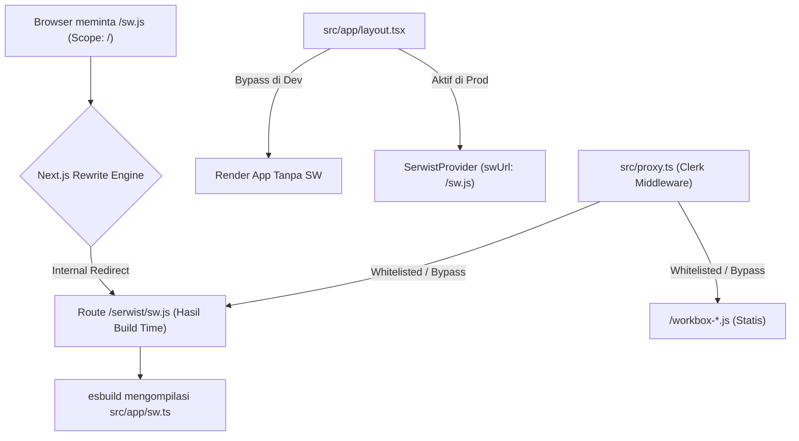

# Panduan Senior Developer: Implementasi PWA & Push Notification dengan Serwist @ Turbopack

Dokumen ini berisi panduan mendalam dan langkah demi langkah untuk menerapkan sistem **PWA (Progressive Web App)** dan **Push Notification (Web Push API)** pada proyek berbasis **Next.js 16+ dengan Turbopack**, khususnya agar dapat berjalan mulus saat dideploy ke platform serverless seperti **Vercel** yang memiliki keterbatasan berkas *read-only*.

---

## 🔍 Mengapa Push Notification & Service Worker di Next.js + Turbopack Terkenal Susah?

Implementasi Service Worker konvensional sering kali gagal di arsitektur modern Next.js + Turbopack karena 3 masalah utama berikut:

### 1. Konflik HMR (Hot Module Replacement) di Mode Development
Di mode dev (`next dev`), Turbopack melakukan pembaruan modul secara dinamis. Jika Service Worker aktif dan melakukan caching agresif, ia akan menangkap chunk pembaruan HMR dan menyimpannya di cache lokal. Akibatnya, browser tidak akan menerima pembaruan UI secara real-time dan developer terpaksa sering menghapus cache secara manual.
*   **Solusi:** Service Worker harus **otomatis dimatikan** saat berjalan di mode development (`process.env.NODE_ENV === "development"`).

### 2. Keterbatasan Read-Only Serverless (Vercel Runtime Compilation Fail)
Pustaka PWA standar (seperti Workbox lama atau Serwist versi dinamis) biasanya mengompilasi Service Worker pada saat ada permintaan (*request-time*) menggunakan `esbuild` dan menulis hasilnya ke disk server. Di platform serverless seperti Vercel, direktori runtime bersifat **read-only**. Operasi menulis file `sw.js` akan memicu error perizinan (*write permission denied*), menyebabkan aplikasi crash.
*   **Solusi:** Service Worker harus dikompilasi secara **Statis saat Proses Build (`next build`)** menggunakan fitur ekspor parameter generasi statis Next.js.

### 3. Masalah Cakupan Service Worker (Scope Timeout / Ready Hang)
Sesuai standar keamanan web browser, cakupan (*scope*) Service Worker dibatasi oleh lokasi direktori file-nya. Jika Service Worker dilayani dari `/serwist/sw.js`, maka cakupannya hanya terbatas di rute `/serwist/*`. Jika halaman utama berada di `/dashboard`, panggilan `navigator.serviceWorker.ready` akan menggantung (*hang*) selamanya karena `/dashboard` berada di luar jangkauan scope SW.
*   **Solusi:** Service Worker harus disajikan secara fisik seolah-olah berada di root `/sw.js` dengan mengonfigurasi fitur **Next.js Rewrites** di `next.config.ts` dan menyetel header khusus `Service-Worker-Allowed: /`.

---

## 🗺️ Alur Arsitektur & Resolusi Rute (Mermaid Diagram)

Berikut adalah bagaimana rute Service Worker didelegasikan, dikompilasi secara statis, dan diakses dari root scope:



---

## 🛠️ Langkah Demi Langkah Implementasi & Kode Sumber

Berikut adalah file-file penting yang digunakan dalam hunian_apps untuk menyiasati masalah di atas:

### 📦 1. Kebutuhan Package (`package.json`)
Pastikan package berikut terpasang. Gunakan versi Serwist terpadu yang kompatibel dengan Next.js dan Turbopack:
```json
{
  "dependencies": {
    "@serwist/next": "^9.5.11",
    "serwist": "^9.5.11",
    "web-push": "^3.6.7",
    "@types/web-push": "^3.6.4"
  },
  "devDependencies": {
    "@serwist/turbopack": "^9.5.11",
    "esbuild": "^0.28.0"
  }
}
```

### ⚙️ 2. Konfigurasi Next.js ([next.config.ts](file:///C:/Users/Dimas/.gemini/antigravity/scratch/hunian_apps/next.config.ts))
Gunakan wrapper `withSerwist` dari `@serwist/turbopack` dan definisikan `rewrites` serta `headers` agar browser mengizinkan Service Worker berjalan di root scope `/` meskipun file tersebut dihasilkan secara internal dari rute statis `/serwist/*`.

```typescript
import type { NextConfig } from "next";
import { withSerwist } from "@serwist/turbopack";

const nextConfig: NextConfig = {
  turbopack: {},
  compress: true,

  // Pastikan header Service Worker dikonfigurasi dengan benar
  async headers() {
    return [
      {
        // Berikan izin Root Scope untuk Service Worker asli
        source: "/sw.js",
        headers: [
          {
            key: "Service-Worker-Allowed",
            value: "/",
          },
          {
            key: "Cache-Control",
            value: "public, max-age=0, must-revalidate",
          },
          {
            key: "Content-Type",
            value: "application/javascript; charset=utf-8",
          },
        ],
      },
      {
        // Berikan izin untuk rute internal serwist
        source: "/serwist/:path*",
        headers: [
          {
            key: "Service-Worker-Allowed",
            value: "/",
          },
          {
            key: "Cache-Control",
            value: "public, max-age=0, must-revalidate",
          },
          {
            key: "Content-Type",
            value: "application/javascript; charset=utf-8",
          },
        ],
      },
    ];
  },

  // Rewrite /sw.js ke hasil kompilasi statis di /serwist/sw.js
  async rewrites() {
    return [
      {
        source: "/sw.js",
        destination: "/serwist/sw.js",
      },
      {
        source: "/sw.js.map",
        destination: "/serwist/sw.js.map",
      },
      {
        source: "/:slug(workbox-.*)",
        destination: "/serwist/:slug",
      },
    ];
  },
};

export default withSerwist(nextConfig);
```

### 📂 3. Route Handler Static Compiler ([src/app/serwist/[path]/route.ts](file:///C:/Users/Dimas/.gemini/antigravity/scratch/hunian_apps/src/app/serwist/[path]/route.ts))
Ini adalah bagian krusial agar kompilasi Service Worker terjadi di **Build Time**. Dengan mengekspor seluruh properti penanganan statis (`dynamic`, `dynamicParams`, `revalidate`, `generateStaticParams`), Next.js akan memicu kompilasi esbuild saat menjalankan perintah `next build`, sehingga menghasilkan file statis yang siap disajikan.

```typescript
import { spawnSync } from "node:child_process";
import { createSerwistRoute } from "@serwist/turbopack";

// Ganti revisi secara dinamis berdasarkan commit hash git saat build
const revision =
  spawnSync("git", ["rev-parse", "HEAD"], { encoding: "utf-8" }).stdout?.trim() ??
  crypto.randomUUID();

export const { dynamic, dynamicParams, revalidate, generateStaticParams, GET } = createSerwistRoute({
  swSrc: "src/app/sw.ts", // Mengarah ke file core Service Worker Anda
  additionalPrecacheEntries: [],
  useNativeEsbuild: true,
});
```

### 🧠 4. Core Service Worker ([src/app/sw.ts](file:///C:/Users/Dimas/.gemini/antigravity/scratch/hunian_apps/src/app/sw.ts))
File ini menangani caching runtime menggunakan Serwist serta mendengarkan event `push` dari browser untuk menampilkan push notification.

```typescript
import { defaultCache } from "@serwist/next/worker";
import type { PrecacheEntry, SerwistGlobalConfig } from "serwist";
import { Serwist } from "serwist";

declare global {
  interface WorkerGlobalScope extends SerwistGlobalConfig {
    __SW_MANIFEST: (PrecacheEntry | string)[] | undefined;
  }
}

declare const self: any;

const serwist = new Serwist({
  precacheEntries: self.__SW_MANIFEST,
  skipWaiting: true,
  clientsClaim: true,
  navigationPreload: true,
  runtimeCaching: defaultCache,
});

serwist.addEventListeners();

// Menangani event push notification masuk
self.addEventListener("push", (event: any) => {
  if (!event.data) return;

  try {
    const data = event.data.json();
    const title = data.title || "Notifikasi Baru";
    const options = {
      body: data.body || "",
      icon: data.icon || "/icon-192.png",
      badge: "/icon-192.png",
      data: {
        url: data.url || "/dashboard",
      },
    };

    event.waitUntil(self.registration.showNotification(title, options));
  } catch (err) {
    console.error("Gagal parse push payload:", err);
    const text = event.data.text();
    event.waitUntil(
      self.registration.showNotification("Hunian", {
        body: text,
        icon: "/icon-192.png",
        data: { url: "/dashboard" },
      })
    );
  }
});

// Mengalihkan pengguna ketika notifikasi diklik
self.addEventListener("notificationclick", (event: any) => {
  event.notification.close();
  const urlToOpen = event.notification.data?.url || "/dashboard";

  event.waitUntil(
    self.clients.matchAll({ type: "window", includeUncontrolled: true }).then((windowClients: any) => {
      // Cari window yang sudah terbuka, fokuskan jika rutenya sama
      for (let i = 0; i < windowClients.length; i++) {
        const client = windowClients[i];
        const clientPath = new URL(client.url).pathname;
        const targetPath = new URL(urlToOpen, client.url).pathname;
        if (clientPath === targetPath && "focus" in client) {
          return client.focus();
        }
      }
      // Buka window baru jika belum terbuka
      if (self.clients.openWindow) {
        return self.clients.openWindow(urlToOpen);
      }
    })
  );
});
```

### 🛡️ 5. Pengecualian Autentikasi ([src/proxy.ts](file:///C:/Users/Dimas/.gemini/antigravity/scratch/hunian_apps/src/proxy.ts))
Jika Anda menggunakan Clerk Auth atau middleware proteksi rute lainnya, rute Service Worker dan aset precaching PWA **wajib dibebaskan (whitelisted)** agar dapat diakses tanpa sesi autentikasi. Jika diblokir, PWA tidak akan bisa diinstal dan registrasi SW akan macet.

```typescript
const isPublicRoute = createRouteMatcher([
  "/",
  "/sign-in(.*)",
  "/sign-up(.*)",
  "/manifest.json", // File Manifest PWA
  "/sw.js",         // Service Worker utama di Root
  "/workbox-(.*)",  // Chunk internal Workbox/Serwist
  "/serwist/(.*)",  // Aset kompilasi statis Serwist
]);
```

### 🧬 6. Inisialisasi Serwist di Layout ([src/app/layout.tsx](file:///C:/Users/Dimas/.gemini/antigravity/scratch/hunian_apps/src/app/layout.tsx))
Bungkus aplikasi menggunakan `SerwistProvider` hanya di mode produksi guna mematikan caching SW selama pengembangan lokal agar tidak memicu error Hot-Reload.

```typescript
import { SerwistProvider } from "@serwist/turbopack/react";

export default function RootLayout({ children }: { children: React.ReactNode }) {
  return (
    <html lang="id">
      <body>
        <ClerkProvider>
          {process.env.NODE_ENV !== "development" ? (
            <SerwistProvider swUrl="/sw.js">
              {children}
            </SerwistProvider>
          ) : (
            children
          )}
        </ClerkProvider>
      </body>
    </html>
  );
}
```

---

## 📲 Client-Side Push Subscription Logic
Untuk mendaftarkan browser pengguna agar menerima push notification dari backend server, gunakan script pendaftaran berbasis VAPID Key. Potongan kode di bawah merupakan logika inti yang digunakan di komponen [notifications-form.tsx](file:///C:/Users/Dimas/.gemini/antigravity/scratch/hunian_apps/src/app/dashboard/settings/notifications/_components/notifications-form.tsx):

### Mendaftarkan / Mematikan Notifikasi
```typescript
const handleToggleNotification = async (enable: boolean) => {
  try {
    let registration = await navigator.serviceWorker.getRegistration();
    
    // FALLBACK: Daftarkan SW secara manual jika SerwistProvider dilewati (misal di localhost/ngrok)
    if (!registration) {
      registration = await navigator.serviceWorker.register('/sw.js', { scope: '/' });
    }

    if (!registration) {
      throw new Error("Service Worker tidak aktif. Pastikan HTTPS aktif dan aplikasi berjalan di mode produksi.");
    }

    // Pastikan service worker benar-benar siap (ready) sebelum dipanggil
    const reg = await Promise.race([
      navigator.serviceWorker.ready,
      new Promise<never>((_, reject) =>
        setTimeout(() => reject(new Error("Timeout menunggu Service Worker siap.")), 5000)
      ),
    ]);

    if (enable) {
      // 1. Minta Izin Notifikasi dari Browser
      const status = await Notification.requestPermission();
      if (status !== "granted") {
        throw new Error("Izin notifikasi ditolak oleh browser.");
      }

      // 2. Konversi VAPID Public Key dari Environment Variable
      const vapidPublicKey = process.env.NEXT_PUBLIC_VAPID_PUBLIC_KEY;
      if (!vapidPublicKey) throw new Error("VAPID Public Key belum disetel.");
      const convertedVapidKey = urlBase64ToUint8Array(vapidPublicKey);

      // 3. Daftarkan Perangkat ke Push Server Browser (Google FCM, Apple APNs, dsb)
      const sub = await reg.pushManager.subscribe({
        userVisibleOnly: true,
        applicationServerKey: convertedVapidKey,
      });

      // 4. Simpan Data Subscription ke Database via Server API
      await fetch("/api/push/subscribe", {
        method: "POST",
        headers: { "Content-Type": "application/json" },
        body: JSON.stringify({
          subscription: sub,
          deviceInfo: navigator.userAgent,
        }),
      });

      toast.success("Notifikasi push berhasil diaktifkan!");
    } else {
      // Unsubscribe jika dinonaktifkan
      const sub = await reg.pushManager.getSubscription();
      if (sub) {
        await fetch("/api/push/subscribe", {
          method: "DELETE",
          headers: { "Content-Type": "application/json" },
          body: JSON.stringify({ endpoint: sub.endpoint }),
        });
        await sub.unsubscribe();
      }
      toast.success("Notifikasi dinonaktifkan.");
    }
  } catch (error: any) {
    toast.error(error.message || "Gagal memperbarui status notifikasi.");
  }
};

// Fungsi utilitas konversi base64
function urlBase64ToUint8Array(base64String: string) {
  const padding = "=".repeat((4 - (base64String.length % 4)) % 4);
  const base64 = (base64String + padding).replace(/\-/g, "+").replace(/_/g, "/");
  const rawData = window.atob(base64);
  const outputArray = new Uint8Array(rawData.length);
  for (let i = 0; i < rawData.length; ++i) {
    outputArray[i] = rawData.charCodeAt(i);
  }
  return outputArray;
}
```

---

## 🖥️ Backend Push Sender Logic
Pada sisi backend, kita menggunakan library `web-push` untuk mengirim notifikasi push ke perangkat browser berdasarkan subscription yang disimpan di PostgreSQL menggunakan Drizzle ORM. Implementasi lengkapnya ada di [push.ts](file:///C:/Users/Dimas/.gemini/antigravity/scratch/hunian_apps/src/lib/push.ts):

```typescript
import webpush from "web-push";
import { db } from "@/db";
import { pushSubscriptions } from "@/db/schema";
import { eq } from "drizzle-orm";

// 1. Inisialisasi webpush dengan VAPID Details
if (
  process.env.NEXT_PUBLIC_VAPID_PUBLIC_KEY &&
  process.env.VAPID_PRIVATE_KEY &&
  process.env.VAPID_SUBJECT
) {
  webpush.setVapidDetails(
    process.env.VAPID_SUBJECT,
    process.env.NEXT_PUBLIC_VAPID_PUBLIC_KEY,
    process.env.VAPID_PRIVATE_KEY
  );
}

export async function sendPushNotificationToOwner(
  ownerId: string,
  payload: { title: string; body: string; url?: string; icon?: string }
) {
  if (
    !process.env.NEXT_PUBLIC_VAPID_PUBLIC_KEY ||
    !process.env.VAPID_PRIVATE_KEY ||
    !process.env.VAPID_SUBJECT
  ) {
    console.warn("Kunci VAPID tidak lengkap di env. Lewati pengiriman push.");
    return;
  }

  // 2. Ambil seluruh subscription terdaftar milik Owner
  const subscriptions = await db.query.pushSubscriptions.findMany({
    where: eq(pushSubscriptions.ownerId, ownerId),
  });

  const notificationPayloadString = JSON.stringify({
    ...payload,
    icon: payload.icon || "/icon-192.png",
  });

  // 3. Kirim ke seluruh perangkat secara paralel
  const sendPromises = subscriptions.map(async (sub) => {
    const pushSub = {
      endpoint: sub.endpoint,
      keys: {
        p256dh: sub.p256dh,
        auth: sub.auth,
      },
    };

    try {
      await webpush.sendNotification(pushSub, notificationPayloadString);
    } catch (error: any) {
      // JIKA SUBSCRIPTION EXPIRED (Status 410 atau 404):
      // Browser memberitahu bahwa subscription ini sudah tidak berlaku (uninstalled / reset).
      // Hapus dari database agar tidak membebani server dan kuota pengiriman berikutnya.
      if (error.statusCode === 410 || error.statusCode === 404) {
        console.info(`Menghapus push subscription kedaluwarsa: ${sub.id}`);
        await db.delete(pushSubscriptions).where(eq(pushSubscriptions.id, sub.id));
      } else {
        console.error("Gagal mengirim push notification:", error);
      }
    }
  });

  await Promise.all(sendPromises);
}
```

---

## ⚡ Panduan Pengujian Lokal (Local Testing Guide)

Agar fitur Web Push Notification dapat diuji coba dengan lancar di komputer lokal Anda, ikuti protokol berikut:

1.  **Gunakan HTTPS Tunneling (ngrok):**
    Browser modern melarang penggunaan Web Push API dan kamera pada protokol HTTP non-aman. Anda wajib menjalankan ngrok untuk mendapatkan URL HTTPS:
    ```bash
    npm run tunnel
    ```
2.  **Daftarkan URL Terowongan di Konfigurasi:**
    Pastikan domain ngrok yang Anda gunakan telah dimasukkan ke dalam `allowedDevOrigins` di [next.config.ts](file:///C:/Users/Dimas/.gemini/antigravity/scratch/hunian_apps/next.config.ts) agar tidak diblokir oleh CORS Next.js.
3.  **Wajib Menjalankan Mode Produksi:**
    Service Worker tidak diaktifkan pada mode `dev` untuk kenyamanan HMR. Lakukan build aplikasi dan jalankan server lokal produksi:
    ```bash
    npm run build
    npm run start
    ```
    Buka alamat HTTPS ngrok Anda pada browser (bukan `localhost:3000`), pasang aplikasi (PWA Install), lalu coba aktifkan notifikasi di halaman pengaturan akun.
